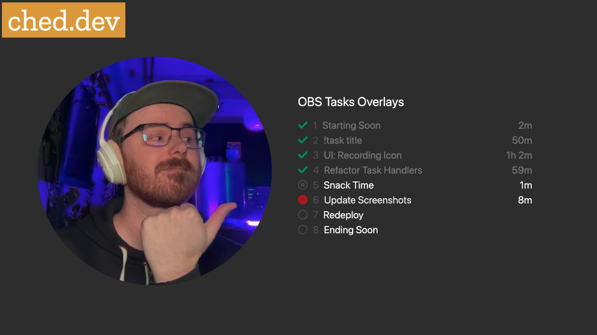
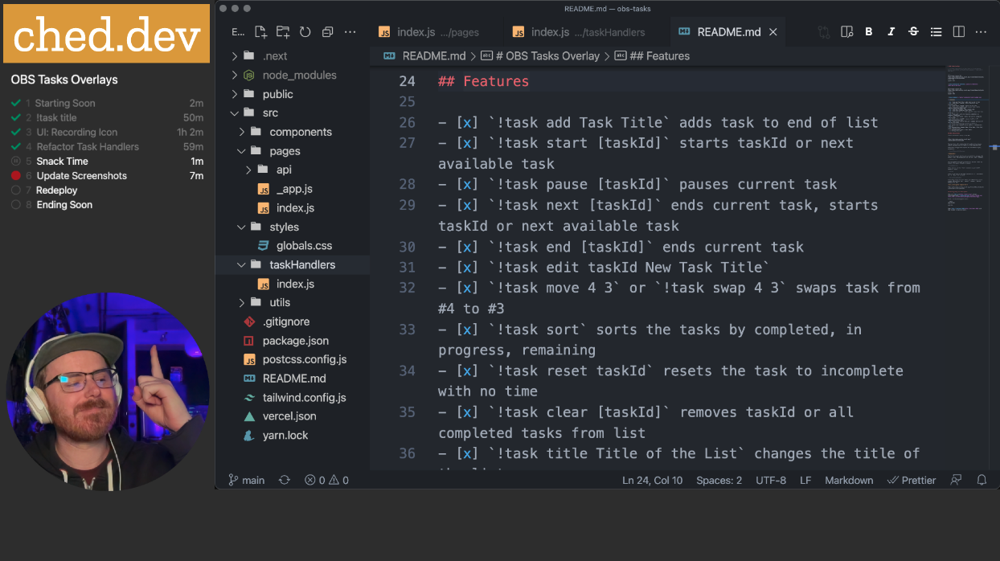

# OBS Tasks Overlay

> A browser application to show Tasks in an OBS Browser Source, controlled via Twitch chat commands (`!task add A New Task`)


```
OBS Browser Source URL: 
https://obs-tasks-overlay.vercel.app/?username=ched_dev&title=Stream%20Tasks&scale=2&verticalAlign=middle
Width: 800
Height: 800
```



```
OBS Browser Source URL: 
https://obs-tasks-overlay.vercel.app/?username=ched_dev&title=Stream%20Tasks&scale=1.2
Width: 400
Height: 400
```



## Features

- [x] `!task add Task Title`
- [x] `!task start [taskId]`
- [ ] `!task pause [taskId]`
- [x] `!task end [taskId]`
- [x] `!task edit taskId New Task Title`
- [ ] `!task move 4 3`
- [x] `!task clear [taskId]`
- [x] Saved to localStorage (enabled by default)
- [ ] Saved to database
- [x] Configuration: Allow Mods, Title Text, Scale, Vertical Align
- [ ] Configuration: Colors, Font Family

## OBS Installation

Load a new Browser Source to the URL:

```
https://obs-tasks-overlay.vercel.app/?username=twitchUsername
```

The task list will stretch the full width of the browser source, allowing you to create it at your desired size.

Additional configuration options are available as query parameters:

> username=twitchUsername

**Required**

The Twitch users channel to join and watch for messages. By default, only the broadcaster can run the `!task` commands.

> allowMods=true

Allow mods to run the `!task` commands on your behalf. Defaults `false`.

> title=Title Text

Show a Title above the task list

> scale=2

Scale of the text on the page. Defaults to `1`, increments by `.1`. E.g. `1.4` is valid

> verticalAlign=middle

Vertically aligns the list within your OBS browser source window. Options are `top`, `center`, `middle`, `bottom`. Defaults to `top`.

**Fully Configured Example URL:**
```
https://obs-tasks-overlay.vercel.app/?username=ched_dev&title=Stream%20Tasks&scale=2&verticalAlign=middle
```

## Getting Setup for Development

This is a [Next.js](https://nextjs.org/) project bootstrapped with [`create-next-app`](https://github.com/vercel/next.js/tree/canary/packages/create-next-app).

First, run the development server:

```bash
npm run dev
# or
yarn dev
```

Open [http://localhost:3000](http://localhost:3000) with your browser to see the result.
